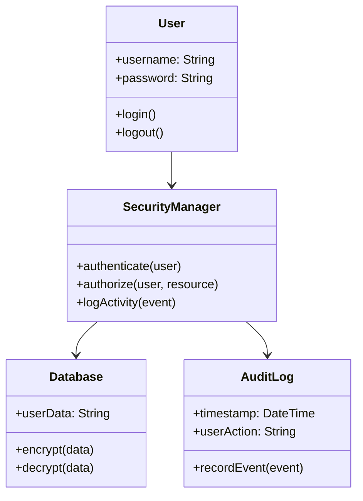

# Assignment 7

## Question 1: Why is it important to rank the importance of various stakeholders involved in system development?

Ranking stakeholders is important because:

1. **Limited Resources** - Development teams can't satisfy everyone equally. Time, budget, and personnel constraints mean priorities must be set. Ranking helps decide who gets priority when making security decisions.

2. **Conflicting Requirements** - Different stakeholders want different things. End users might prioritize ease of use, while security teams focus on protection, and executives care about cost. A clear ranking system helps resolve conflicts by giving more weight to higher-priority stakeholders.

3. **Risk Management** - Some stakeholders pose bigger security risks than others. External users, contractors, and third-party integrators may need different security controls than internal employees. Ranking helps focus security efforts where they matter most.

4. **Decision Making** - When tough choices must be made about security features, stakeholder ranking provides a clear framework for decisions. This prevents arbitrary choices and ensures consistent prioritization throughout the project.

5. **Communication and Buy-in** - Knowing who the most important stakeholders are helps teams communicate effectively and get necessary approval for security measures that might impact functionality or user experience.

6. **Threat Modeling** - Understanding stakeholder importance directly impacts how threats are assessed. High-priority stakeholders' access paths and potential vulnerabilities receive more attention during security analysis.

## Question 2: Sketch a UML diagram for the security of a software system. 

## References

Kohnfelder, L. (2021). Designing Secure Software. Random House Publishing Services.

Richardson, T., & Thies, C. N. (2012). Secure Software Design. Jones & Bartlett Learning.